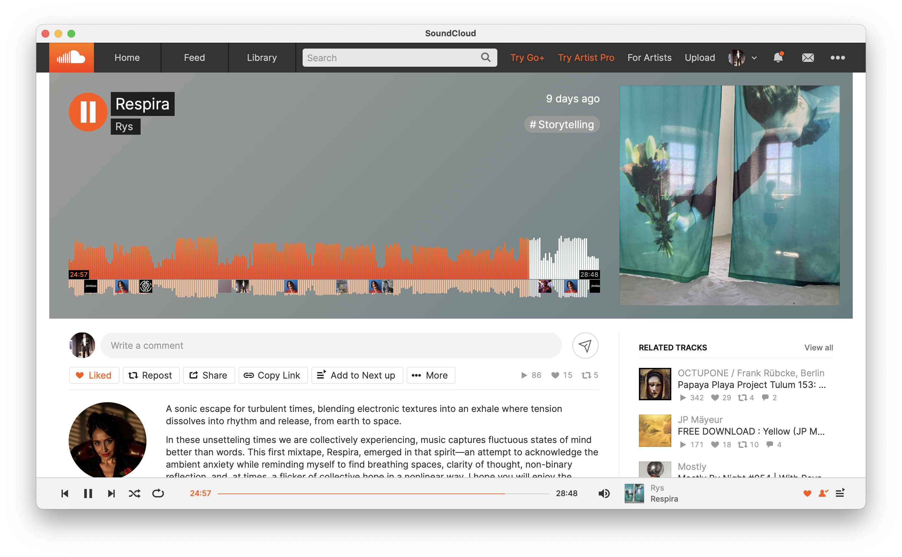

# SoundCloud for macOS

I just added Tab management and tab bar UI, use cmd+T for new tab/cmd+W to close tab, and option click (right-click) > Open In a New Window to open in a New Tab

Things to implement maybe : 
    - Custom menu (right-click menu)
    - Shortcut for open in a new tab
/////////

SoundCloud doesn't offer a native macOS app: let me fix that for them! 

This is a very simple Swift application that wraps the SoundCloud web app using a `WKWebView`. It allows you to log in to SoundCloud (email/password, no OAuth for now) and persist your session via cookies. 



## Requirements

- macOS 10.15 or later
- Xcode 12 or later
- Swift 5

## Installation and Compilation

Follow the steps below to download and compile the project in Xcode.

### (Recommended) Compile from source code

#### 1. Clone the Repository

- Open Terminal and run:

```bash
git clone https://github.com/yourusername/SoundCloudWrapperApp.git
```

- Or download the ZIP archive from GitHub and unzip it.

#### 2. Open the Project in Xcode

- Navigate to the project folder.

- Double-click the SoundCloudWrapperApp.xcodeproj file to open the project in Xcode.

#### 3. Build the Project

- In Xcode, select the appropriate scheme (the default should work for you).

- Click Product > Build (or press Cmd+B) to compile the project.

#### 4. Run the App

- With the project open in Xcode, click Product > Run (or press Cmd+R).

- The app window should appear displaying the SoundCloud login page in the embedded web view.

- Log in as you normally would—the app uses a persistent cookie store to keep you logged in even after closing and re-opening the app.

### (Alternative) Install unsigned binary

This isn't a generally recommended way to download applications. However, if you are not comfortable using Xcode and compiling your own binary, you can follow the steps below (do this at your own risk):

#### 1. Download the app binary

- [Download the volume image](https://github.com/rlacombe/SoundCloud-macOS/releases/download/v0.1.0/SoundCloud.dmg) (`SoundCloud.dmg` file) and open it in Finder.

- Move the SoundCloud app to the `Applications` folder on your Mac.

#### 2. By-pass 

- Launch the app by double clicking on it; you will see an error message.

- Click on the `?` icon in the upper right and follow instructions to open the app anyway.


## Contributing

Feel free to fork this repository and submit pull requests if you have improvements or fixes. 

Ideas for improvements:

- manage OAuth authentication (requires pop-ups)

- bind to the MacBook reverse | play | forward keys

- feel free to suggest any other ideas!

## License

This project is licensed under the [MIT License](https://opensource.org/license/mit).

## Contact

For any questions or issues, please [open an issue](https://github.com/rlacombe/SoundCloud-macOS/issues) on GitHub.
